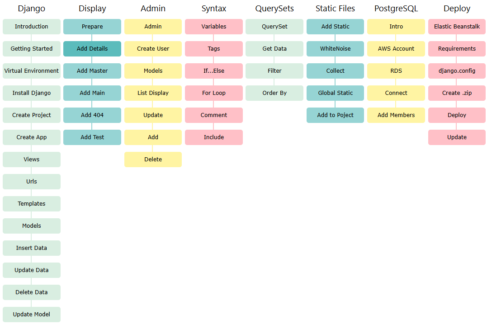

## W3Schools

O curso da W3Schools segue uma abordagem **learning by doing**, ensinando passo a passo a:

- Instalar e configurar um ambiente Django
- Criar um projeto completo (CRUD)
- Trabalhar com modelos, visualizações e templates
- Utilizar Django Template Tags
- Manipular dados com QuerySets (filtros, ordenações, etc)
- Conectar o projeto a um banco PostgreSQL
- Preparar e realizar o deploy do projeto

> A versão do Django utilizada no tutorial da W3Schools é a 4.0.3 (março de 2022).

---

## Mapa de Estudos

A imagem abaixo (captura da W3Schools) representa os tópicos do curso:



Os tópicos estão organizados em seções como:

- **Django** (instalação e estrutura)
- **Display** (exibição e templates)
- **Admin** (painel administrativo)
- **Syntax** (tags e lógica de templates)
- **QuerySets**
- **Static Files**
- **PostgreSQL**
- **Deploy**

---

## Referência

Curso completo disponível em: [https://www.w3schools.com/django/index.php](https://www.w3schools.com/django/index.php)

---

## Impressões Pessoais Sobre o Curso da W3Schools

Como curso **introdutório**, o tutorial de Django da W3Schools cumpre muito bem o seu papel. Ele apresenta de forma clara os **conceitos fundamentais do framework**, como o padrão arquitetural **MVT (Model-View-Template)**, a importância do arquivo `urls.py` para o roteamento das requisições, e o uso de `models.py` com **ORM (Object Relational Mapping)** para manipulação dos dados de forma prática e integrada ao banco de dados.

A estrutura do curso permite que o estudante entenda o fluxo básico de funcionamento de uma aplicação Django, e pratique ações essenciais como **criar, exibir, editar e deletar dados**, além de trabalhar com templates e consultar o banco usando QuerySets. É um ótimo ponto de partida para quem nunca teve contato com o framework.

Contudo, por ser voltado para iniciantes, o curso **não aprofunda** em temas mais avançados ou amplamente utilizados no desenvolvimento profissional com Django. Ele **não aborda**:

- O uso de bibliotecas essenciais como `django-crispy-forms`, `django-environ`, `celery`, entre outras;
- A criação e exposição de **APIs**, especialmente com **Django REST Framework (DRF)**;
- A personalização avançada do **Django Admin**, além das configurações básicas;
- A integração com **chatbots**, **inteligência artificial** ou **serviços externos**;
- A construção de **páginas web mais interativas**, com integração entre frontend e backend.

### Prática Adicional com `models.py`

Durante os estudos, para aprofundar meu entendimento sobre o funcionamento do `models.py` e os tipos de campos oferecidos pelo Django, decidi estender o modelo básico apresentado no curso. O modelo original era:

```python
from django.db import models

class Member(models.Model):
  firstname = models.CharField(max_length=255)
  lastname = models.CharField(max_length=255)
```

Para explorar melhor o poder do ORM e os recursos adicionais do Django, evoluí esse modelo para incluir novos tipos de campos, validações e atributos como `verbose_name`, `choices`, `DateField`, `SlugField`, entre outros:

```python
from django.db import models

class Member(models.Model):
    firstname = models.CharField(max_length=255, verbose_name='Primeiro Nome')
    lastname = models.CharField(max_length=255, verbose_name='Sobrenome')
    email = models.EmailField(unique=True, verbose_name='E-mail')
    phone = models.CharField(max_length=20, blank=True, null=True, verbose_name='Telefone')
    birth_date = models.DateField(blank=True, null=True, verbose_name='Data de Nascimento')
    gender = models.CharField(
        max_length=1,
        choices=[('M', 'Masculino'), ('F', 'Feminino')],
        blank=True,
        null=True,
        verbose_name='Gênero'
    )
    address = models.TextField(blank=True, null=True, verbose_name='Endereço')
    # profile_picture = models.ImageField(upload_to='members/photos/', blank=True, null=True, verbose_name='Foto de Perfil')
    is_active = models.BooleanField(default=True, verbose_name='Ativo')
    created_at = models.DateTimeField(auto_now_add=True, verbose_name='Criado em')
    updated_at = models.DateTimeField(auto_now=True, verbose_name='Atualizado em')
    slug = models.SlugField(default="", null=False)

    class Meta:
        ordering = ['firstname']
        verbose_name = 'Membro'

    def __str__(self):
        return f"{self.firstname} {self.lastname}"
```

Essa prática foi essencial para entender:

- Como configurar campos opcionais (`blank`, `null`);
- Como definir escolhas limitadas com `choices`;
- Como usar campos de data e hora automática;
- Como aplicar nomes legíveis com `verbose_name`; e
- Como configurar ordenação e representações personalizadas.
